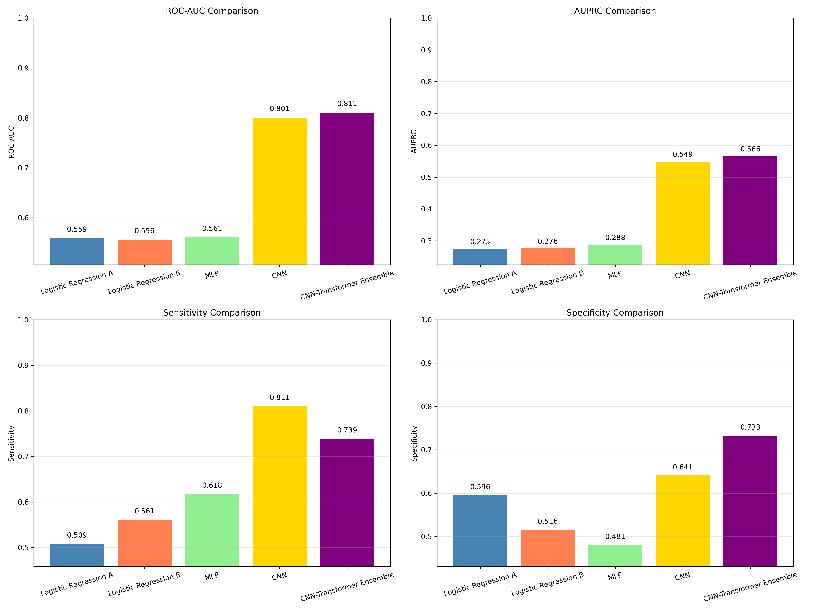
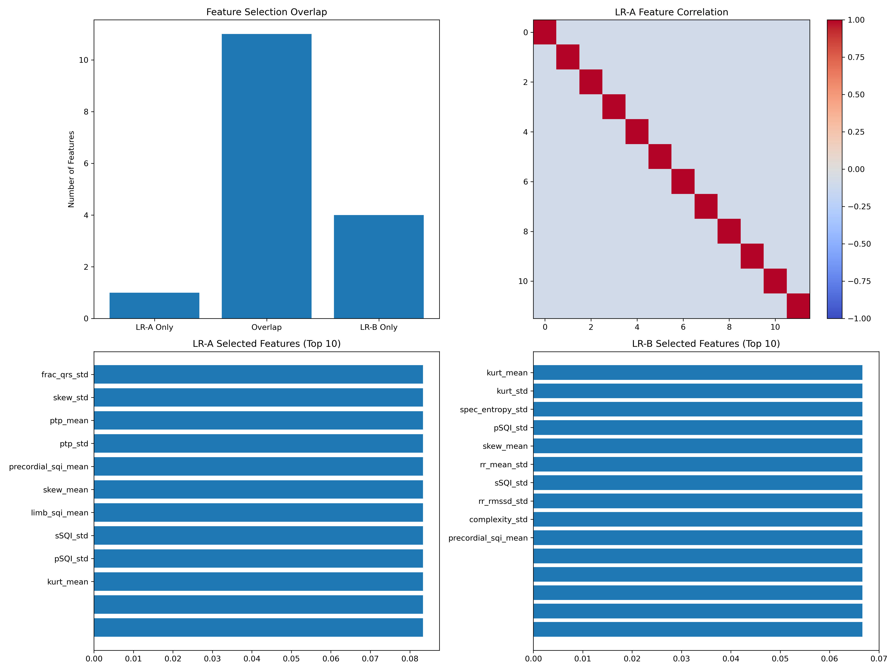
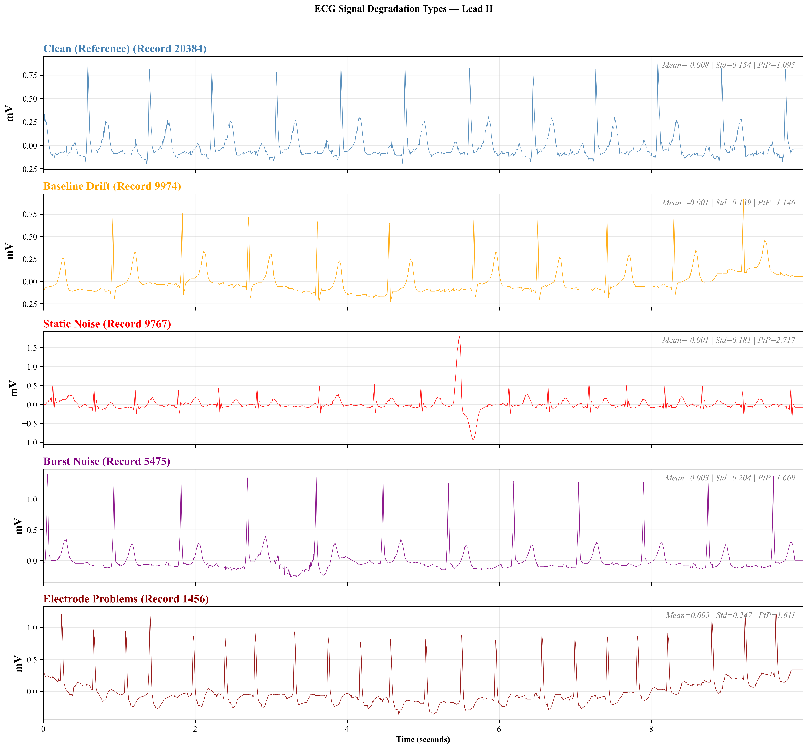
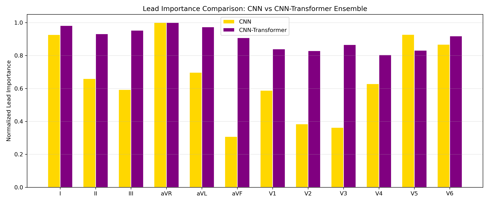

# ECG Signal Quality Detection

**Interpretable Machine Learning for ECG Signal Quality Classification: A Comparative Analysis of Logistic and Deep Learning Approaches**

Reuben N. Addison — MS Analytics Applied Practicum, Georgia Institute of Technology

A progressive benchmark of five machine-learning models for binary classification of 12-lead ECG signal quality (clean vs. degraded), evaluated on the [PTB-XL](https://physionet.org/content/ptb-xl/1.0.3/) dataset.

📄 [Final project report](docs/Final_Project_Report.pdf) · 📊 [Presentation slides](docs/Final_Presentation.pptx)

## Motivation

Poor signal quality in electrocardiograms leads to misdiagnosis and wasted clinical time. Automated quality screening can flag degraded recordings before they reach a cardiologist. This project builds and compares five classifiers of increasing complexity, from a simple logistic regression to a CNN-Transformer ensemble with uncertainty quantification, so practitioners can choose the right accuracy/complexity trade-off for their deployment environment.

## Models

| # | Model | Input | Key Idea |
|---|-------|-------|----------|
| 1 | **Logistic Regression A** | Basic SQI features | L1-regularized, 15 selected features |
| 2 | **Logistic Regression B** | Enhanced SQI features | L1-regularized, 20 selected features including HRV & spectral entropy |
| 3 | **MLP** (DL1) | Basic SQI features | Simple feedforward network with class-weighted BCE loss |
| 4 | **CNN** (DL2) | Raw 12-lead waveforms | 1-D ResNet-style convolutional network |
| 5 | **CNN-Transformer Ensemble** (DL3) | Raw 12-lead waveforms | Multi-scale CNN + Transformer encoder, 5-member ensemble, focal loss, epistemic & aleatoric uncertainty, conformal prediction |

All models share the same stratified train / validation / test split (PTB-XL `strat_fold`), the same threshold-optimization procedure (Youden, F2, cost-sensitive), and the same evaluation metrics so results are directly comparable.

## Results

Held-out test-fold performance (thresholds Youden-optimized):

| Model | ROC-AUC | AUPRC | Sensitivity | Specificity |
|-------|--------:|------:|------------:|------------:|
| Logistic Regression A | 0.559 | 0.275 | 0.509 | 0.596 |
| Logistic Regression B | 0.556 | 0.276 | 0.561 | 0.516 |
| MLP (DL1) | 0.561 | 0.288 | 0.618 | 0.481 |
| CNN (DL2) | 0.801 | 0.549 | 0.811 | 0.641 |
| **CNN-Transformer Ensemble (DL3)** | **0.811** | **0.566** | 0.739 | **0.733** |



**Key finding:** handcrafted SQI features plateau at ~0.56 AUC regardless of the classifier placed on top of them, while end-to-end deep learning on raw 12-lead waveforms captures degradation patterns that feature engineering cannot — jumping to ~0.80+ AUC. The ensemble additionally provides calibrated uncertainty estimates for clinical deployment. See the [final report](docs/Final_Project_Report.pdf) for the full analysis.

## Features & Signal Processing

**Preprocessing pipeline** — applied per-lead before feature extraction:
1. Baseline removal via median filter
2. 60 Hz notch filter (Q = 30)
3. Low-pass Butterworth filter (40 Hz, 3rd order)

**Basic SQI features** (per-lead, then aggregated across 12 leads as mean ± std): signal statistics (mean, std, RMS, peak-to-peak, skew, kurtosis), Hjorth parameters (mobility, complexity), spectral power bands (total, QRS-band, baseline, high-frequency), power-fraction ratios, and composite indices (pSQI, kSQI, sSQI, basSQI).

**Enhanced SQI features** add: inter-detector agreement (iSQI) between Pan-Tompkins and Hamilton R-peak detectors, HRV statistics (RR mean, std, RMSSD, CV), spectral entropy, inter-lead correlation statistics, and limb/precordial SQI group means.

Feature selection uses variance thresholding followed by mutual-information ranking.



## Dataset

**PTB-XL** — 21,799 twelve-lead ECG recordings (10 s, 500 Hz) with clinician annotations. Degradation labels are derived from four noise-annotation columns (`baseline_drift`, `static_noise`, `burst_noise`, `electrodes_problems`): any non-zero annotation marks a recording as *degraded*.



> Wagner, P., et al. "PTB-XL, a large publicly available electrocardiography dataset." *Scientific Data* 7, 154 (2020).

## Evaluation

Every model is assessed on the held-out test fold with:

- **ROC-AUC** and **AUPRC** (area under the precision-recall curve)
- **Sensitivity / Specificity / PPV / NPV** at the Youden-optimal threshold
- **Expected Calibration Error (ECE)**
- Per-model diagnostic dashboards (ROC & PR curves, calibration plot, confusion matrix, threshold analysis) — see [`figures/`](figures/)

The CNN-Transformer ensemble additionally reports epistemic uncertainty (inter-member disagreement), aleatoric uncertainty, and conformal-prediction coverage.

## Interpretability

Gradient-based saliency analysis is included for both deep-learning models that operate on raw waveforms:

- **Vanilla gradients** and **Gradient × Input** maps for the CNN and CNN-Transformer
- **Ensemble-averaged saliency** for the CNN-Transformer (mean across 5 members)
- **Lead-importance comparison** — per-lead mean |grad × input| to reveal which ECG leads each architecture relies on most



## Project Structure

```
├── ECG_Classifier_V3.ipynb    # Full pipeline: data → features → training → evaluation
├── requirements.txt           # Python dependencies
├── docs/
│   ├── Final_Project_Report.pdf   # Final practicum report
│   └── Final_Presentation.pptx    # Presentation slides
├── figures/                   # Key result figures (dashboards, architectures, saliency)
├── output_clinical/           # Cached models, features, and dashboards (generated, git-ignored)
└── README.md
```

## Quick Start

1. **Install dependencies** (Python ≥ 3.9):

```bash
pip install -r requirements.txt
```

2. **Download PTB-XL** from [PhysioNet](https://physionet.org/content/ptb-xl/1.0.3/) and extract it.

3. **Set the data path** — open the notebook and update `DATA_PATH` near the top of the *Data and Feature Loading* section to point at your extracted PTB-XL directory.

4. **Run the notebook end-to-end.** Models and features are automatically cached to `output_clinical/` so subsequent runs skip expensive computation.

```bash
jupyter notebook ECG_Classifier_V3.ipynb
```

GPU/MPS acceleration is detected automatically for the CNN and CNN-Transformer models; the pipeline falls back to CPU if neither is available.

## Caching

Every trained model and extracted feature set is persisted to disk with a deterministic parameter hash. Changing a hyperparameter (e.g. learning rate, number of ensemble members) produces a new cache key, so you can experiment without overwriting previous results.

## License

This project is provided for research and educational purposes. The PTB-XL dataset is available under the [Open Data Commons Attribution License (ODC-BY v1.0)](https://physionet.org/content/ptb-xl/1.0.3/).
